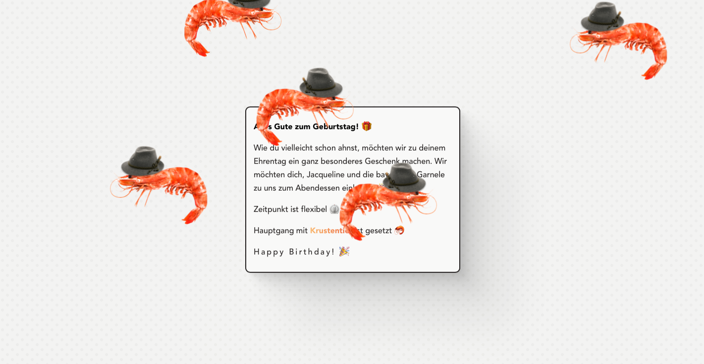

<p align="center">

</p>

# Bavarian Shrimp
Birthday present featuring animated shrimp. Set up using Vite. Deployed to Github Pages.

## Installation Instructions

### Clone this repository

```bash
git clone https://github.com/michaelheckmann/bavarian-shrimp.git
```

### Install dependencies

```bash
cd bavarian-shrimp
npm install
```

### Run the dev server

```bash
npm run dev
```
